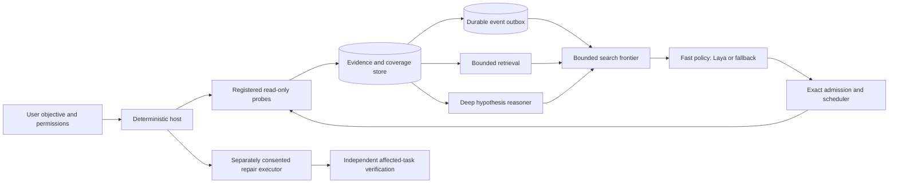

# Adaptive investigator architecture

SystemSense is a local-first investigator, not an autonomous shell. The host
owns every observation, clock, probe binding, admission, permission, and
verification result. Fast and deep models are replaceable advisers. A model
can select an advertised read-only candidate or ask for more evidence; it
cannot construct an executable command or authorize a repair.

The arrows describe the intended architecture, not a claim that every route
is already mounted. Persisted probe results can repeatedly trigger bounded
asynchronous Laya follow-ups. The opt-in mixed frontier now ranks already-stored
case evidence references, rechecks source/generation, and delivers exact
retrieved records into the bounded context. Its measurement-candidate path and
the independent deep worker are still unmounted; this is not a general mixed
policy or a measured diagnostic improvement. Deep reasoning still
runs after a collection batch or on an explicit fast escalation, not concurrently
with that batch. The evidence relationship graph represents observed
machine entities with provenance. The curated dependency graph suggests
mechanisms and probes, but is not evidence of a cause. The scheduler's work
graph expresses prerequisites and resource limits; it is neither of those
knowledge graphs.

## Execution boundary

1. A collector finishes and the owner commits its execution, evidence, and
   coverage. An outbox event is committed with the same result where the
   adaptive path is mounted. The collection time is not substituted for the
   source observation time.
2. A separate bounded policy worker reads an immutable, redacted snapshot.
   Inference never runs in the persistence transaction or scheduler lock.
   Semantic packets carry a fact, quality, timestamps, omissions, and grounded
   relation IDs. Missing and denied evidence remain explicit.
3. The worker offers a reference, not a command. The scheduler owner validates
   the full task graph, the original parent evidence digest, exact presented
   current-case rows, target/window, manifest, deadline, capacity, and budget
   before writing an admission. An asynchronous offer without a frozen decision
   snapshot and read set is rejected.
   A successful admission still does not claim the probe ran. The execution
   and result are linked separately; interruption is uncertain and not replay
   authority.
4. Retrieval of an already stored fact should be cheaper than a new probe.
   Branch reconsideration and deep review should follow meaningful uncertainty
   changes, not merely an increase in raw evidence count.

## Deployment and training boundary

The fully local profile uses local replaceable providers. A consumer
cloud-both profile must export only specifically approved projections through
an authenticated, bounded case session; both remote roles may share that
approved context, but all host authority stays local. The present cloud
module is an in-process contract fake, not a network provider or permission
to export machine state. There is no paid cloud integration in this milestone.
An in-process host-resource policy and a separate SQLite cross-process lease
ledger can reserve configured fast/deep CPU, RAM, and VRAM budgets. The ledger
was tested under simultaneous independent processes and crash expiry, but is
not mounted as production admission: trusted device-bound telemetry, validated
model footprints, renewal throughout inference, and a safe stop on lost lease
are still required. It never evicts unrelated GPU work.
An Ollama client lease alone is insufficient: the separate server may keep the
27B weights resident or continue generation after the client closes, so the
lease must cover and verify server-side lifetime before it can protect a GPU.

The deep-worker contract freezes a request and exact case read set, detaches
provider input, and classifies late or stale results without applying them.
To make both brains useful at once, the coordinator must consume persisted
result events during a collection epoch, split deep request preparation from
response application, and revalidate hypotheses and probes at that boundary.
Running an unadmitted background call would only produce historical advice
after new evidence arrives, so it has not been mounted as apparent overlap.

The first proposed student objective is to rank useful retrievals and next
measurements from the exact information available at decision time. Candidate
identity includes the resolved target and observation window. A probe result
or teacher draft is not an independently reviewed utility label, and an
unrun alternative is unknown rather than negative. No weights should be
updated until source custody, label validity, split leakage, and exact
worker-input parity pass. See [the local-teacher plan](../LAYA_TRAINING_PLAN.md)
and [pilot-corpus contract](../PILOT_CORPUS.md).

## Measured status

The synthetic event-to-admission harness measures SQLite event persistence,
queueing, fake inference, validation, admission, and scheduler start. It proves
only plumbing behavior. An opt-in pinned Laya 0.3.5 CUDA run on this RTX 4090
measured 28 distinct synthetic judgments (8 fact packets and 20 probe
descriptions) in 0.437-0.438 seconds warm, with full worker coverage
and zero cache hits. A counterbalanced 4/8/16-packet by 4/8/20-batch sweep
completed 27/27 attempts; cell p95 ranged 0.42-0.61 seconds. Its three samples
per cell do not establish a production latency distribution, and none met the
proposed 400 ms event-to-admission target even before application overhead.
The first cold judgment took 27.97 seconds in the initial run; sampled owned
process-tree peak RAM was about 3.16 GiB. These numbers do not measure useful
probe selection, ordinary laptops, controlled Windows diagnosis, or verified
affected-task recovery. The reports remain local, outside Git. See
[benchmark protocol](../BENCHMARK_PROTOCOL.md) and the active delivery record.
