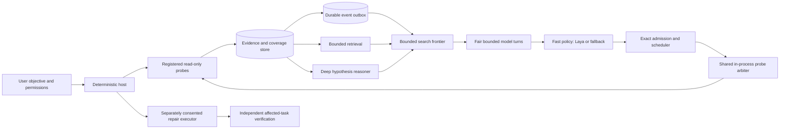

# Adaptive investigator architecture

SystemSense is a local-first investigator, not an autonomous shell. The host
owns every observation, clock, probe binding, admission, permission, and
verification result. Fast and deep models are replaceable advisers. A model
can select an advertised read-only candidate or ask for more evidence; it
cannot construct an executable command or authorize a repair.

The arrows include both mounted and proposed routes. Persisted probe results
can repeatedly trigger bounded asynchronous Laya follow-ups. The mixed
frontier ranks already-stored case evidence, source-bound relationship branches,
and durable deep questions; it rechecks source/generation and delivers exact
retrieved records into the bounded context. Its measurement-candidate path is
currently a PDF-process-target slice, not a general mixed policy. The deep
worker can now reason on a frozen evidence map while an independent read-only
collection batch runs. Its eventual advice is applied only by the coordinator
after source revalidation and remains historical if newer observations were
not in the frozen request. None of these routes establishes measured diagnostic
improvement. The evidence relationship graph represents observed
machine entities with provenance. The curated dependency graph suggests
mechanisms and probes, but is not evidence of a cause. The scheduler's work
graph expresses prerequisites and resource limits; it is neither of those
knowledge graphs. Default runtimes in one Python interpreter now share a
fair, bounded probe arbiter. Its slot is released only when the underlying
worker exits, including after a reported timeout. Queue saturation is an
explicit blocked outcome. Separate processes and the passive recorder do
not yet share this probe budget, so this is not whole-host arbitration.
Fast-model callbacks also take FIFO turns through a separate in-process gate,
with at most 16 registered case workers. The lease spans each actual callback,
not the entire case queue; a waiting case does not run its model until its turn.
Deadline and cancellation do not revoke an in-flight callback. The owner closes
its offer queue at case stop, audits unconsumed exact-parent offers, and never
turns a late model suggestion into an admitted probe. This is not cross-process
model arbitration, GPU memory reservation, or proof of faster diagnosis.

### Frontier evidence-input custody gate

The PDF-process measurement slice does not accept caller-supplied semantic
packet text as source truth. A plausible ID and timestamp can still describe
a nonexistent fact. Schema 24 instead freezes an immutable pre-inference
receipt derived from no more than 16 exact typed, authorized current-case or
explicit passive-history rows under a SQLite snapshot. It records source-row
digests, case/incident scope, pinned redaction and serializer versions, and up
to 24 ordered redacted packet bytes. The ranking snapshot binds that receipt;
capture, admission, and worker claim rederive and compare the source projection.
A historical row retains historical scope and cannot satisfy a live measurement
prerequisite. An unrelated append need not invalidate the unchanged read set,
but that new evidence was not considered by this choice. The receipt authenticates
what Laya saw, not whether its ranking is useful or causal. The general
measurement-ranker path and held-out utility validation are still missing.

### Diagnostic question custody

Schema 26 introduces one registered, read-only WLAN association test. Its
append-only admission freezes the exact question and competing predictions,
trusted current-case source digest, interface GUID/window, case epoch,
objective/hypothesis digests, v3 probe manifest, parameters, and plan instance.
The owner atomically consumes one dispatch claim before scheduling. The result
transaction binds that claim to the actual audit event and probe execution,
then stores an evaluated, unknown, or failed terminal from source-owned
evidence. An unlinked consumed claim is interrupted rather than replayed;
missing or corrupt source custody cannot yield a true/false observation.
The exclusive case owner reconciles claimed work after restart. A previously
evaluated terminal whose required source is later deleted remains immutable,
but trusted readback fails rather than presenting its old boolean as current
proof.

Schema 27 mounts this narrow question in the live investigator when a complete,
fresh transitional WLAN baseline justifies one bounded re-probe. The verified
branch result reaches both advisory models and the stop decision after source
revalidation. It can establish association state, not a Wi-Fi root cause or
Internet reachability; other diagnostic questions remain unqualified.

## Execution boundary

1. A collector finishes and the owner commits its execution, evidence, and
   coverage. An outbox event is committed with the same result where the
   adaptive path is mounted. The collection time is not substituted for the
   source observation time.
2. A separate bounded policy worker reads an immutable, redacted snapshot.
   Inference never runs in the persistence transaction or scheduler lock.
   Semantic packets carry a fact, quality, timestamps, omissions, and grounded
   relation IDs. Missing and denied evidence remain explicit.
3. The worker offers a reference, not a command. The scheduler owner validates
   the full task graph, the original parent evidence digest, exact presented
   current-case rows, target/window, manifest, deadline, capacity, and budget
   before writing an admission. An asynchronous offer without a frozen decision
   snapshot and read set is rejected.
   A successful admission still does not claim the probe ran. The execution
   and result are linked separately; interruption is uncertain and not replay
   authority.
4. Retrieval of an already stored fact should be cheaper than a new probe.
   Branch reconsideration and deep review should follow meaningful uncertainty
   changes, not merely an increase in raw evidence count.

## Deployment and training boundary

The fully local profile uses local replaceable providers. A consumer
cloud-both profile must export only specifically approved projections through
an authenticated, bounded case session; both remote roles may share that
approved context, but all host authority stays local. The present cloud
module is an in-process contract fake, not a network provider or permission
to export machine state. There is no paid cloud integration in this milestone.
An in-process host-resource policy and a separate SQLite cross-process lease
ledger can reserve configured fast/deep CPU, RAM, and VRAM budgets. The
same-user cross-process lease is mounted for managed CUDA Laya, with host
telemetry and worker-exit release. The ledger was also tested under simultaneous
independent processes and crash expiry. It is **not** yet production admission
for a joint Laya/Qwen runtime: trusted server-side Qwen lifetime, validated
joint footprints, renewal and safe stop on lost lease still require qualification.
It never evicts unrelated GPU work.
An Ollama client lease alone is insufficient: the separate server may keep the
27B weights resident or continue generation after the client closes, so the
lease must cover and verify server-side lifetime before it can protect a GPU.

The mounted deep-worker path freezes a request, exact current-case read set,
matching detail keys, and catalog page before provider work. A per-case durable
mailbox owns admission, one running task, terminal reconciliation, and atomic
advisory/checkpoint completion. Its worker receives detached input and no store.
The owner may overlap read-only collection; it does not apply a deep result
inside an active collection epoch. At the coordinator boundary it validates
the source basis, makes unconsidered new observations explicit, and treats all
model hypotheses as unresolved or contested until deterministic assessment.
Exact requests and catalog pages advance only when the frozen material was
actually delivered and acknowledged. True mid-epoch deep-directed probe
admission remains unimplemented and needs its own typed authorization route.

The first proposed student objective is to rank useful retrievals and next
measurements from the exact information available at decision time. Candidate
identity includes the resolved target and observation window. A probe result
or teacher draft is not an independently reviewed utility label, and an
unrun alternative is unknown rather than negative. No weights should be
updated until source custody, label validity, split leakage, and exact
worker-input parity pass. See [the local-teacher plan](../LAYA_TRAINING_PLAN.md)
and [pilot-corpus contract](../PILOT_CORPUS.md).

## Measured status

The synthetic event-to-admission harness measures SQLite event persistence,
queueing, fake inference, validation, admission, and scheduler start. It proves
only plumbing behavior. An opt-in pinned Laya 0.3.5 CUDA run on this RTX 4090
measured 28 distinct synthetic judgments (8 fact packets and 20 probe
descriptions) in 0.437-0.438 seconds warm, with full worker coverage
and zero cache hits. A counterbalanced 4/8/16-packet by 4/8/20-batch sweep
completed 27/27 attempts; cell p95 ranged 0.42-0.61 seconds. Its three samples
per cell do not establish a production latency distribution, and none met the
proposed 400 ms event-to-admission target even before application overhead.
The first cold judgment took 27.97 seconds in the initial run; sampled owned
process-tree peak RAM was about 3.16 GiB. These numbers do not measure useful
probe selection, ordinary laptops, controlled Windows diagnosis, or verified
affected-task recovery. The reports remain local, outside Git. See
[benchmark protocol](../BENCHMARK_PROTOCOL.md) and the active delivery record.
The new opt-in committed-event-to-admission harness includes real provider,
validation, and admission phases with every miss in the denominator. Its first
real-Laya attempt stopped before model startup because unrelated GPU activity
could not be ruled out; it produced no new timing samples.
