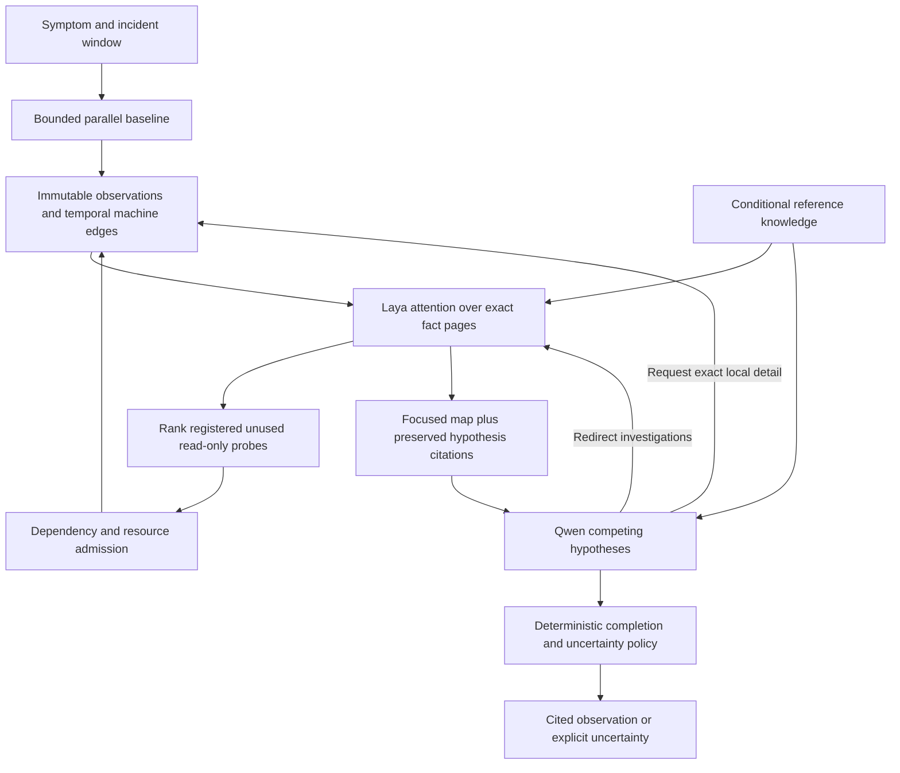

# Active local investigation

The product is an investigator, not an MCP report generator. The two advisory
providers are replaceable. Their current local implementations are Laya typed
decisions and standard Qwen3.8 27B; neither model owns measurements or permissions.

## Responsibilities

`Investigator` owns the durable state machine. Baseline collectors run before the
first model call. Laya ranks evidence and eligible actions; a second attention
pass evaluates newly collected facts before Qwen receives them. The coordinator
checks provider identity, state version, correlation, deadlines, budgets, probe
IDs and citations. A model output is not an executable command.

Qwen receives a bounded evidence map, not the raw computer state. It can redirect
the next probe frontier, request another observation, or issue a literal search
inside one already admitted observation. Detail searches cannot access arbitrary
paths, SQL, URLs or other cases. Completed requests are tracked and a reasoning
round has at most two retrieval-only follow-ups.

The execution graph and diagnostic graph are different structures. The former
coordinates dependencies between jobs. The latter records sourced relationships
between machine components. Traversal selects relevant information but does not
establish causality.

## Memory and context correctness

- Source time, capture time, incident window and case deadline are independent.
- Fact paging retains original values and identifies excerpts as parts of the
  same observation, not independent supporting measurements.
- An active hypothesis retains the exact facts it previously saw. Keeping its
  evidence ID while substituting a different page would change the meaning of
  its citation, so the coordinator persists the admitted context.
- Exact endpoint/PID retrieval supplements model attention. It is a scoped lookup,
  not a keyword-based investigation planner or an inferred dependency.
- Required citations and coverage gaps survive ranking. Token admission uses a
  pinned local tokenizer. Optional background reference text is reduced before
  observed facts; every omission remains explicit.
- General documentation stays separate from machine observations. An error-code
  description or possible mechanism does not prove that condition occurred.

## Model and resource choices

The standard Qwen3.8 27B Q4_K_M artifact is pinned by digest. Its measured 8K-context
GPU residency is about 17.30 GB on this RTX 4090. An 8K context preserves headroom
for Laya. Larger advertised context capacity is not a reason to allocate it on a
shared 24 GB GPU. The previous Qwen3.5 runner was explicitly unloaded for testing;
no unrelated model weights were deleted.

Laya's CPU implementation was too slow for the measured broad attention workload.
The separately pinned CUDA runtime uses batches of four, releases unused scratch
allocation between requests, and retains warm model weights. Its small encoder
requires token-aware instruction splitting and complete-field state admission.
Ordinal scores are attention rankings, not probabilities of a Windows diagnosis.

System RAM and GPU free memory are checked before inference. The current measured
single-GPU profile has tight headroom and rejects requests if the reserve is not
available. It never unloads another workload to recover. Model acquisition is a
separate explicit setup operation, not a side effect of investigation. There is
no cloud or paid fallback. Failure uses clearly labeled deterministic behavior.

Observer effects matter: local inference itself consumes CPU/GPU capacity.
Follow-up measurements include that activity. The case and reasoning packet state
this limitation; a busy GPU during investigation is not proof of the original
complaint.

## Completion and permission boundary

The system may answer a narrowly verified observation question, such as exact
listener ownership, without claiming a broader root cause. The deterministic
assessment generates that answer from typed current facts, not from model prose.
Other cases end with supported uncertainty, exhausted budget, cancellation or an
explicit observability gap. Repeated probes and repeated detail searches cannot
masquerade as progress.

Read-only investigation does not imply consent for a repair. Existing proposal
and consent contracts are not an enabled executor. A production repair boundary
still needs typed operation adapters, independently evaluated preconditions,
durable single-use consent, an action journal and independent outcome verification.
Successful collection or a valid model response must never be labeled a verified
repair or a measured diagnostic-accuracy result.

## Qualification boundary

Unit and integration tests establish contracts and failure behavior. Synthetic
real-inference cases establish model protocol behavior. Live cases establish
end-to-end runtime and observations. None alone establishes general root-cause
accuracy, Laya's diagnostic action quality, or the safety of fine-tuning data.
Those require reviewed held-out incidents and separately evaluated action labels.
