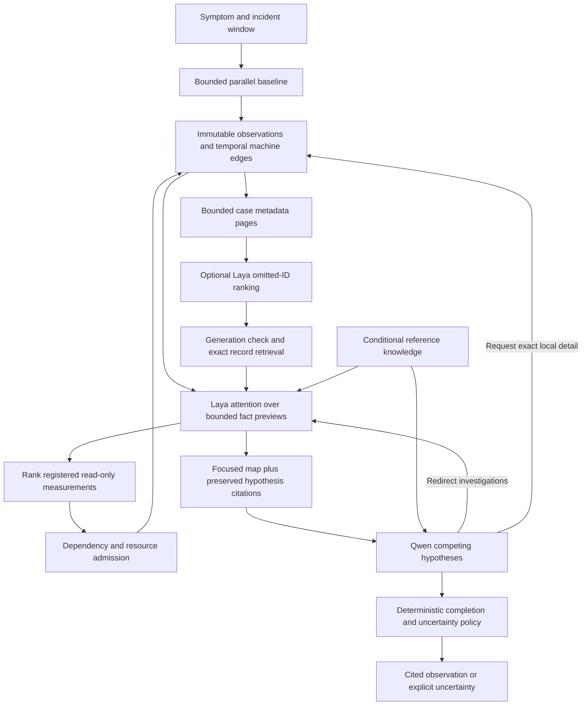

# Active local investigation

The product is an investigator, not an MCP report generator. The advisory
providers are replaceable. Current managed GPU execution pairs schema-v3 CUDA
Laya attention with deterministic reasoning. Qwen3.8 27B was pinned and measured
in earlier local research, but is not admitted alongside managed Laya. Installed
legacy GPU profiles degrade deterministically; neither model owns measurements
or permissions.

This diagram shows the intended two-model read-only loop and historical local
integration; its Qwen branch is not active in managed schema-v3 GPU mode. The
current managed path routes focused evidence to deterministic reasoning. The
intended product loop extends it with a versioned causal claim, an exact repair
proposal, trusted human review, a single-use execution claim, live target recheck, constrained
adapter write, independent affected-task retry, and durable success/failure
report. None of those stages may be collapsed into a model response. The
proposal store and narrow WinINet runner exist as disconnected groundwork, not
an enabled path from the browser to a native write.

References to Qwen in the investigation details below describe the earlier
local research integration and the intended future deep-brain contract. Managed
schema-v3 CUDA execution currently uses deterministic reasoning.

## Responsibilities

`Investigator` owns the durable state machine. Baseline collectors run before the
first model call. Laya ranks evidence and eligible actions; a second attention
pass evaluates newly collected facts before Qwen receives them. The coordinator
checks provider identity, state version, correlation, deadlines, budgets, probe
IDs and citations. A model output is not an executable command.

The deep brain may attach a bounded categorical expected fact to a hypothesis,
such as a registered probe's expected problem code. The coordinator timestamps
that prediction after accepting the reasoning response. A later fast-brain
round can request a new deep review when an exact newer value conflicts, but
only if the relevant preview page was considered and its complete, unsplit text
was attested by the worker. A cache hit, omitted fact, partial observation, or
unverified presentation cannot raise this contradiction signal. Two rounds
without usable new observations can separately raise a no-progress signal.
These are requests to reconsider, not deterministic cause findings; the
coordinator still decides which registered read-only work is admissible.

The optional catalog lane exposes only bounded, explicitly untrusted metadata
for records outside the focused packet. Laya selects case-local IDs; it cannot
create observations or citations. The coordinator rejects invalid or stale
rankings and retrieves the selected persisted records before regular fast/deep
reasoning. A durable cursor and per-generation seen set bound repeated paging;
unfitted selected records remain eligible. The pinned local worker admits four
candidates per call, so the adapter ranks a larger window in small batches and
interleaves ordinal winners without treating batch scores as globally
calibrated. This path remains unqualified for diagnostic utility.
The regular Laya evidence and probe ranker follows the same ordinal rule across
its batches. Cached ranks bind the exact state and ordered batch; a partially
evicted batch is rerun in full rather than mixing scores from different worker
presentations.

Qwen receives a bounded evidence map, not the raw computer state. It can redirect
the next probe frontier, request another observation, or issue a literal search
inside one already admitted observation. Detail searches cannot access arbitrary
paths, SQL, URLs or other cases. Completed requests are tracked and a reasoning
round has at most two retrieval-only follow-ups.

Validated deep-brain distinguishing requests are stored in the case checkpoint,
so a resumed investigation does not forget them. At the next bounded batch,
eligible deep requests take priority and Laya fills remaining slots; both still
pass the same registered read-only, dependency, budget, and deduplication gates.
Stale requests retire rather than silently shadowing a valid fast-brain proposal.
The model can cite one observation inconsistently as both support and
contradiction. The local parser keeps that citation only as contradiction,
marks its hypothesis contested, and records the normalization; it never
promotes such advice into a confirmed diagnosis.

The execution graph and diagnostic graph are different structures. The former
coordinates dependencies between jobs. The latter records sourced relationships
between machine components. Traversal selects relevant information but does not
establish causality.
Predeclared dependent jobs can start after their prerequisite is durably
recorded while unrelated jobs continue. A first opt-in adaptive slice also
lets the concrete bounded Laya provider choose one additional broad,
parameter-free read-only probe after a baseline observation commits, while
unrelated probes remain active. The owner thread freezes the decision and
durably admits the exact invocation before dispatch; a missing child outcome
is uncertain and is not replayed. This is not general live replanning:
target/window candidates, multiple follow-up cycles, other providers with
proven callback deadlines, and held-out speed/diagnostic benefit remain open.
Privacy retention may later remove the parent raw observation. The admission
then remains an attempted action, but full evidence-digest readback is
unverifiable and must fail closed; a privacy-safe retention receipt that
preserves historical custody without retaining raw content is future work.
Current machine-edge routing includes only narrowly validated broad-coverage
hints. A reported named volume can lead from a fresh unique volume-to-disk
mapping to registered event coverage; incomplete or ambiguous topology cannot
create that hint. The route does not prove a disk fault or that the event probe
will cover the exact device.
When an initial evidence packet omits observations, `Investigator.packet()`
checks a bounded page of observed, current-incident machine edges supported by
visible records. A directed one-hop adjacency lookup can bring linked records
into the same 48-record packet ahead of lower-priority facts, only if every edge
provenance record fits and is current for that case. The indexed source-entity
lookup avoids loading the full graph. The frontier is intentionally bounded,
so absence from the packet does not mean absence from the machine or repository.

When Laya or another fast provider has no eligible proposal, the coordinator
may use a registered distinguishing probe from a relevant conditional reference
relation. This is a bounded fallback, not a generic cheapest-probe sweep or a
claim that a relation holds on the current machine. An irrelevant or exhausted
reference frontier yields explicit insufficient observability.

The current connectivity collector illustrates the evidence boundary. One
read-only call records separately timed WLAN, IP/DNS, default-route, WinINet
proxy, and recent WLAN-event stages. A compact preview keeps stage statuses,
times, counts, and omissions inside the inference fact budget; the full redacted
snapshot remains available as a separate local fact. Deterministic assessment
requires fresh source times and sufficient coverage before making absence
statements, and issues only unresolved hypotheses. Configured DNS, a route, or
a proxy does not prove endpoint reachability, affected-app scope, or root cause.

For a slow-PDF objective, a separate deterministic branch pauses after the
baseline `application.snapshot` when it has current-case process candidates
and enough budget. The browser shows names and PIDs with creation time,
collection interval, source evidence ID, and omission count. It sends only an
opaque candidate ID to `POST /api/cases/{case_id}/process-target`; the server
accepts it only for the awaiting case under its normal loopback origin and CSRF
rules. The insert-only binding records the evidence digest and PID/creation
identity. On resumption, the case catalog exposes one opaque target handle and
observable to both advisory providers. A versioned proposal may request that
registered measurement, but it cannot supply a PID or arbitrary process
selector. The coordinator validates the exact handle and may use a typed
deterministic fallback if the models choose no eligible work. It routes the
request through a local measurement registry, rechecks the case and selection
before scheduling and again in the queued worker, then lets the collector
check live PID/creation identity. Audit and task deduplication bind the same
invocation. A changed binding produces an explicit gap or unavailable result;
a generic proposal cannot run this targeted probe. The adapter currently
covers only this selected-process measurement, not general targets or windows.
A pre-execution gap is a durable investigation record and warning, not a forged
probe execution or evidence fact; the deep brain does not yet receive it as a
typed context atom. That model-visible gap contract remains to be built.
A pending attempt recovered after interruption is not silently replayed. This
branch is an observation, not permission to terminate the process or an
assessment of PDF page-turn latency.

## Memory and context correctness

- Source time, capture time, incident window and case deadline are independent.
- Fact paging retains original values and identifies excerpts as parts of the
  same observation, not independent supporting measurements.
- An active hypothesis retains the exact facts it previously saw. Keeping its
  evidence ID while substituting a different page would change the meaning of
  its citation, so the coordinator persists the admitted context.
- Exact endpoint/PID retrieval supplements model attention. It is a scoped lookup,
  not a keyword-based investigation planner or an inferred dependency.
- Required citations and coverage gaps survive ranking. Token admission uses a
  pinned local tokenizer. Optional background reference text is reduced before
  observed facts; every omission remains explicit.
- General documentation stays separate from machine observations. An error-code
  description or possible mechanism does not prove that condition occurred.

The evidence contract distinguishes four kinds of result: an observed
fact (for example, a reported listener owner), a supported but nonconclusive
explanation (target-side failure correlated to nearby owner evidence), a proposed
action, and independently verified recovery. The controlled port harness has
persisted target-side bind failure and bracketing listener observations inside
the case store, allowing one narrowly supported explanation. Its retry and HTTP
recovery checks remain harness-side, not a consumer repair claim. Each promotion
requires its own source, timestamp, coverage and contradiction checks. Unknown
is a valid terminal state when any required link is missing.

## Model and resource choices

The standard Qwen3.8 27B Q4_K_M artifact is pinned for research by digest. Its
measured 8K-context
GPU residency is about 17.30 GB on this RTX 4090. An 8K context preserves headroom
for Laya in the historical joint test. Managed v3 does not admit this overlap.
Larger advertised context capacity is not a reason to allocate it on a
shared 24 GB GPU. The previous Qwen3.5 runner was explicitly unloaded for testing;
no unrelated model weights were deleted.

Laya's CPU implementation was too slow for the measured broad attention workload.
The separately pinned CUDA runtime uses batches of four, releases unused scratch
allocation between requests, and retains warm model weights. Its small encoder
requires token-aware instruction splitting and complete-field state admission.
Ordinal scores are attention rankings, not probabilities of a Windows diagnosis.

The legacy Ollama provider checks available system RAM and GPU memory before
its local requests. Laya separately requires at least 5 GiB of available host RAM before
starting or restarting its worker; its CUDA worker also checks free VRAM at load.
For a verified, fully GPU-resident Qwen instance, subsequent calls use a smaller
free-VRAM floor than a cold load; the resident name, model, digest, context,
expiry, and memory placement must match the pinned profile. This prevents a
loaded model from being counted twice as a new allocation while retaining a
separate cold-load reserve. It does not cap total memory use.
Unknown or insufficient capacity declines the optional worker and visibly falls
back to deterministic attention without unloading another workload. These are
admission floors, not running memory caps or ordinary-laptop qualification: a
historical warm Laya worker did not recheck host RAM on every request. Managed
v3 instead binds an exact worker identity to a lease, checks fresh telemetry
before every call, and quarantines uncertain release. The historical joint
single-GPU profile had tight headroom. Model acquisition is a separate explicit
setup operation, not a side effect of investigation. There is no cloud or paid
fallback.

Observer effects matter: local inference itself consumes CPU/GPU capacity.
Follow-up measurements include that activity. The case and reasoning packet state
this limitation; a busy GPU during investigation is not proof of the original
complaint.

## Completion and permission boundary

The system may answer a narrowly verified observation question, such as exact
listener ownership, without claiming a broader root cause. It can also support
one typed temporal explanation: the target's observed WinError 10048 bind failure
bracketed by complete exact-endpoint listener-table queries with the same stable
owner. Each table query has separate start/end times from the later owner lookup;
the first must finish before the target failure, the second must start afterward,
and the owner process must predate the table query. The assessor re-reads the
full persisted records because the bounded model-facing preview is not
sufficient to prove complete endpoint coverage.
The deterministic assessment generates these claims from typed current facts,
not from model prose. Matching owners around the failure do not prove ownership
at the failure instant; a socket can change hands between reads. This is one
controlled integration result, not general diagnostic accuracy or a verified
consumer fix.
Other cases end with supported uncertainty, exhausted budget, cancellation or an
explicit observability gap. Repeated probes and repeated detail searches cannot
masquerade as progress. A directed round counts new progress only from usable
current-incident observations with consistent source/capture times; failed
coverage, old cases and out-of-window readings remain visible but do not reset
the no-progress counter. A still-eligible deep-brain distinguishing probe may
run even after two barren rounds.

For corrected multi-step collectors without source-provided sample instants,
the deterministic layer records collection start and completion and marks the
completion as an upper bound (`bounded_interval`), not an exact physical
measurement time. Source-provided event and process creation times remain
separate. Listener evidence also records the tighter table-read interval because
joining process identities occurs afterward. The GPU graph hint requires all
three bounded query intervals to fit the incident window and a recent runtime
capture. Future temporal claims must inspect the relevant subquery interval,
not merely the enclosing collection time.

Read-only investigation does not imply consent for a repair. Existing proposal
and consent contracts are not an enabled executor. A production repair boundary
still needs typed operation adapters, independently evaluated preconditions,
durable single-use consent, an action journal and independent outcome verification.
Successful collection or a valid model response must never be labeled a verified
repair or a measured diagnostic-accuracy result.

There is a fake-tested WinINet proxy repair runner and a native adapter with
active-interactive-session, primary-token, non-impersonation, and read-only
managed-policy checks. A fixed-descriptor lab oracle contract records separate
current-user WinINet and direct-control evidence without accepting model-supplied
destinations. The isolated native transport implements separate PRECONFIG and
DIRECT access types with a bounded child-process request. The journal binds a
single-use token to the case, target and authorization and persists the failed
affected path, passing direct control, and post-change affected path. These
contracts are groundwork, not an enabled automatic fixer: there is no owned
external endpoint, mounted application approval route, VM qualification, or
independently demonstrated recovery. The registry policy checks do not cover
all MDM, GPP, VPN or application-level restrictions. PRECONFIG plus a passing
DIRECT check alone does not prove the request used the proxy; routing needs an
independent controlled oracle or per-request route evidence.

Crash inspection can compare the current proxy state with the exact journaled
proposal without writing or unlocking the target. An observed intended setting
is not a verified recovery. The loopback browser's session and CSRF token also
do not prove a human approved an action: another local process can request them.
A separate, unmounted SQLite admission store keeps canonical immutable repair
proposals, an exact active proposal ID/digest per case, one review claim per
proposal, and a durable single-use execution claim for a canonical current-user
WinINet SID. The fake-tested runner refuses to reach the writer without
committing the exact execution recheck, and concurrent attempts cannot reserve
the same target. A Windows named mutex adds cooperating-process exclusion around
runner execution; an unavailable mutex leaves the execution claim interrupted
and target-locked. It is not atomic against unrelated software writing the same
Windows setting. The action journal and execution claim are separate records:
neither proves that a person was authenticated or that an applied change
recovered the symptom. Execution targets remain locked across all outcomes
until [separately authorized terminal reconciliation](../REPAIR_RECONCILIATION.md)
is qualified. Its schema and release transaction exist only as an unmounted
storage primitive using the writer's concrete target mutex, without trusted
live verifiers. No native host write or
browser approval route has been enabled.
An unmounted application route now retrieves an immutable server-owned proposal
and consumes a one-use local-dialog witness before minting the authorization.
It rechecks active-user SID, logon session, case binding, and expiry at review
and at the final cooperative write gate. The native prompt has only fake-backed
tests, is not a secure desktop, and is not mounted in the browser or CLI.
Headless and unqualified-policy cases stay read-only.

## Qualification boundary

Unit and integration tests establish contracts and failure behavior. Synthetic
real-inference cases establish model protocol behavior. Live cases establish
end-to-end runtime and observations. None alone establishes general root-cause
accuracy, Laya's diagnostic action quality, or the safety of fine-tuning data.
Those require reviewed held-out incidents and separately evaluated action labels.
The new VM protocol validator only admits internally consistent, rig-claimed
reset/injection/oracle records. No VM controller or measured Windows fault run is
present, and its result explicitly forbids accuracy or repair-success claims.

The opt-in CPU-only typed-feature fast-provider challenger scores only registered
read-only probes from bounded evidence and sourced reference hints. Its graph
score is a routing hint, not a causal assertion; its fixed weights are not
trained. The frozen-request decision profiler records component latency and
sampled process memory for valid, invalid and timed-out calls. Neither tool
changes the default Laya path or measures end-to-end diagnostic performance.
The typed capability contract can carry bounded related-entity hints. A trusted
request-time binder currently sets one low-weight hint: a recent, stable,
three-sample observed GPU→driver relation from `gpu.telemetry.sample` may suggest
the registered read-only `devices.snapshot` probe. It reloads the original
current-case record, checks source/execution/time/fact bindings, and reproduces
the edge before the challenger can score it. That broad snapshot may omit the
GPU driver; the hint neither claims target inspection nor proves the driver
caused a symptom. Other machine edges remain inert until equally explicit
collector-to-capability bridges are validated.

## Next measured improvements

First establish the independently controlled VM lane, owned external endpoint,
and one exact WinINet repair journey, so outcome quality and time-to-recovery
have a real denominator. Qualify human confirmation, atomic review/execution
claiming, and terminal crash reconciliation before the action can be offered
through the application.
Then compare equal-budget deterministic, deep-only, and dual-brain arms on
blinded fault, healthy, and external cases. Use the traces to identify wasted
probes, stale branches, excess model latency, and false causal leaps before
changing attention prompts, batching, or fine-tuning Laya. A compact local
decision model is a candidate for ordinary laptops only after measured latency,
memory, power, and diagnostic quality there; a future cloud reasoner should
remain a replaceable, export-gated advisory provider, not a prerequisite for
the fully local edition.
