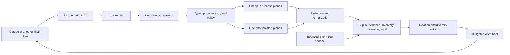

# Architecture

SystemSense turns broad Windows state into a bounded, case-scoped evidence workspace.
The primary optimization is structural: collect once, normalize once, rank once, and
let the AI inspect deeper only through cited IDs.

## Main components

| Component | Responsibility |
|---|---|
| Domain models | Versioned cases, evidence, inventory, coverage, probes, and audit contracts |
| Case planner | Select the common bundle and symptom-relevant probes within time and count budgets |
| Probe catalog and policy | Allow only registered, typed, R1 read-only probes |
| Probe runner | Enforce time, byte, and record limits and normalize execution outcomes |
| One-shot worker | Isolate WMI and package operations that may hang |
| Case runtime | Execute the plan, redact output, and atomically persist evidence and audit |
| Sentinel | Replay-safe incremental Event Log capture with persisted bookmarks |
| SQLite store | Single local source of truth for cases, evidence, inventory history, coverage, artifacts, and audit |
| Brief generator | Pack diverse, high-value cited facts into a hard character budget |
| MCP workspace | Enforce case ownership, opaque pagination, bounded output, and six fixed operations |

## Case lifecycle

1. The client supplies a case kind, symptom text, target traits, time budget, and
   probe-count budget.
2. The planner always considers the common system and resource bundle. It adds only
   registered probes relevant to symptom terms or target traits.
3. Fresh static inventory suppresses redundant optional probes. Common probes remain
   live because resource state can change inside the incident window.
4. Each selected probe passes catalog lookup, typed parameter validation, and
   read-only policy authorization.
5. The runner executes the probe in process or in a one-shot worker, then enforces
   its registered deadline, output-byte limit, and record limit.
6. The runtime redacts sensitive fields, creates provenance-rich evidence and
   timestamped inventory, records explicit coverage on failure, and appends a
   hash-linked audit event.
7. The MCP brief diversity-ranks evidence, includes citations and limitations, and
   omits diagnosis and repair instructions.

## Persistence model

SQLite uses WAL mode, foreign keys, bounded page queries, and explicit transactions.
The main logical records are:

- cases and case targets;
- normalized evidence keyed by case and stable source identity;
- current inventory plus change-only history;
- coverage records for unavailable evidence;
- append-only audit events;
- content-addressed artifacts and case-artifact authority;
- source bookmarks for replay-safe Event Log capture.

Inventory is current-state context. Evidence is case-scoped observation. Audit is
execution accountability. Keeping these roles separate avoids repeatedly collecting
stable driver and settings data while preserving incident-specific evidence.

## Failure semantics

A denied, stale, timed-out, truncated, failed, or unsupported source is a result,
not a missing row or startup failure. The case can become ready with partial
coverage. The AI can distinguish "not observed" from "observed and healthy" without
SystemSense inventing a causal conclusion.

## Resource strategy

- Common probes are cheap and in process.
- Potentially hanging probes are one request per child process.
- Repeated failures open a per-probe cooldown circuit instead of paying the full
  failure cost on every case.
- Every collection surface is bounded by count, bytes, time, or all three.
- SQLite writes are transactional and retention deletes in small batches.
- Evidence summaries and briefs are returned before full records.
- Pagination cursors are opaque and authenticated.
- The runtime performs no polling unless the user starts the bounded sentinel.
