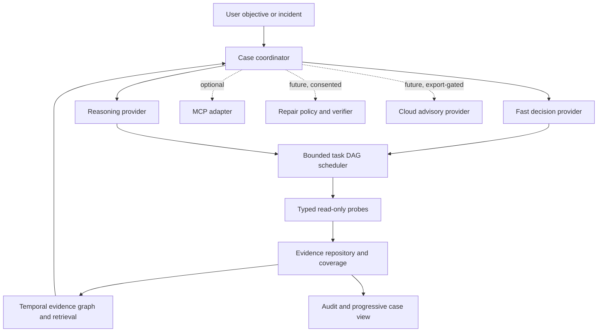

# Architecture

SystemSense is a local-first Windows investigator. Its durable center is a
read-only evidence and case system. Model providers propose attention and
explanations; deterministic software owns collection, timestamps, scheduling,
provenance, policy, and persistence.

## Boundaries

| Component | Responsibility | Current status |
|---|---|---|
| Windows probe packs | Fixed, typed, bounded read-only collection | 16 registered probes, including passive staged connectivity; preview plus full redacted local fact |
| Evidence repository | Evidence, inventory, coverage, artifacts, retention, provenance | Implemented SQLite core |
| Time model | Source observation time, local capture time, execution/audit time | Implemented and tested |
| Evidence graph | Typed, evidence-backed relationships and retrieval context | Durable SQLite relationships, explicit projection, bounded traversal, and current/opted-in history retrieval implemented |
| Case coordinator | Case metadata, state versions, stale-result checks, progress | Durable bounded rounds, hypotheses, budgets, interruption recovery, no-progress detection, and terminal outcomes implemented |
| Task scheduler | DAG dependencies, priority, cancellation, deduplication, resource budgets | Implemented with bounded per-round adaptive replanning |
| Fast decision provider | Repeated fact-page attention, graph-guided focus and probe ranking | Pinned local Laya subprocess; keyword baseline/fallback; relevant reference distinguishing-probe fallback when no proposal; replaceable interface |
| Reasoning provider | Competing hypotheses and distinguishing read-only tests | Reviewed deterministic rules, including unresolved passive connectivity stages, plus optional local Ollama adapter |
| Local application | Loopback case control, bounded export, and foreground passive recording | Implemented with bounded workers and shutdown cancellation |
| Policy and repair | Consent-bound experiments, repairs, preconditions, verification | Typed proposal/consent contracts and fake-tested WinINet repair runner/native adapter exist; no qualified oracle transport, managed-policy guard, app route, or enabled repair |
| MCP | Optional external transport adapter | Separate optional stdio adapter over the neutral workspace; not a core dependency |
| Local inference | Optional advisory providers with local response validation | Explicit Laya + Qwen3.8 27B profile; pinned artifacts/tokenizer, context and memory admission; no cloud fallback |
| Cloud inference | Advisory provider behind export/privacy policy | Not implemented and never an automatic fallback |

## Two different graphs

The task graph is an executable DAG. It describes work dependencies, resource
classes, deadlines, cancellation, and deduplication. It must be acyclic even when
the investigator's hypotheses are not.

The evidence graph describes observed or reviewed relationships between entities.
The current implementation stores a bounded temporal graph in SQLite with typed
provenance and validity filters. Explicit projection rules can derive non-causal
entity relationships from known fact shapes, and retrieval may include specifically
selected historical cases. Edges require provenance, evidence
references, applicability, and temporal meaning; an edge is not causal proof.
Existing category/diversity ranking is presentation logic, not dependency
inference.

A separate reference graph supplies conditional mechanisms, distinguishing probes,
counterevidence and primary-source citations. Installed Windows error definitions
are another bounded reference source. Neither is represented as an observation.
See [the active two-brain architecture](local-two-brain.md) for exact fact memory,
detail requests, model resource choices and completion semantics.

Passive Event Log capture is executable work, not graph evidence by itself. It uses
a fixed isolated worker with a five-second hard deadline. The first read selects a
bounded newest tail and orders that tail ascending for presentation; it explicitly
does not claim that older excluded history is absent.

For passive connectivity, each source stage has its own observation timestamp and
coverage state. The inference preview retains counts and omissions under a fact
budget; the full redacted snapshot remains local. The deterministic stage rules
only produce unresolved possibilities from fresh, sufficiently covered facts.
The reference graph can select a relevant distinguishing probe when a provider
has no proposal, but its conditional edges cannot supply missing machine facts.

## Evidence and time

Every observation carries a stable ID, source/probe identity, source observation
time when available, local capture time, quality/coverage status, limitations, and
redaction classification. Event-log timestamps describe the event; snapshot probe
timestamps describe when the collector observed the state; capture time describes
when SystemSense received it. A case-open timestamp is never substituted for an
observation time.

## Provider contracts

`DecisionRequest` and `ReasoningRequest` bind responses to a case ID, state version,
correlation ID, deadline, bounded redacted evidence content, evidence-grounded graph
relationships, and available typed probe capabilities. Responses are immutable and
checked before scheduling. Proposals name
only known read-only probe IDs and carry a diagnostic purpose, priority, resource
class, deduplication key, catalog-matched cost, and safety/permission class. The
catalog cost, not a provider estimate, controls admission. Proposals cannot contain
commands, paths, URLs, or authority tokens.

The keyword provider is a deterministic baseline and fallback, not a diagnosis
model. Reviewed deterministic reasoning reports only cited observations and
unresolved possibilities. Optional Ollama providers return proposal bodies only;
trusted code supplies the case envelope and catalog-owned fields. Inference is
disabled by default, CPU-only unless GPU use is explicit, and rejects remote or
unverifiable model aliases before chat. There is no automatic provider or paid
fallback.

## Read-only first, repair separately

The first investigator can report supported evidence, competing explanations,
coverage gaps, and a distinguishing read-only probe. A future experiment or repair
requires a separate typed plan, explicit user consent, target/precondition binding,
audit journaling, and independent outcome verification. Model output cannot grant
elevation or expand the action catalog.

The WinINet-specific runner and native adapter are a narrow, unexposed foundation.
The native identity check is stricter than session number alone, and a registered
fixed-destination lab-oracle contract can represent both current-user WinINet and
direct-path readings. No external owned endpoint, qualified isolated native
transport, authoritative managed-policy guard, application route, or real Windows
repair has been delivered. A separate VM-lab contract validates proposed run
records but does not operate a VM or prove an injected fault.

## Design guardrails

- Missing, denied, stale, unsupported, failed, and truncated data are states, not
  zeros or silent omissions.
- Collection inputs, outputs, queues, and resource admission are bounded. Deadlines
  classify and cancel work; hard wall-time termination requires a process-isolated
  probe, because an in-process non-cooperative thread must drain safely.
- Local evidence and deterministic checks remain available if a provider is absent.
- Domain packs describe capabilities and applicability; they cannot invent arbitrary
  privileged operations.
- Performance claims include collection overhead and distinguish fixture checks from
  measured investigation episodes.
