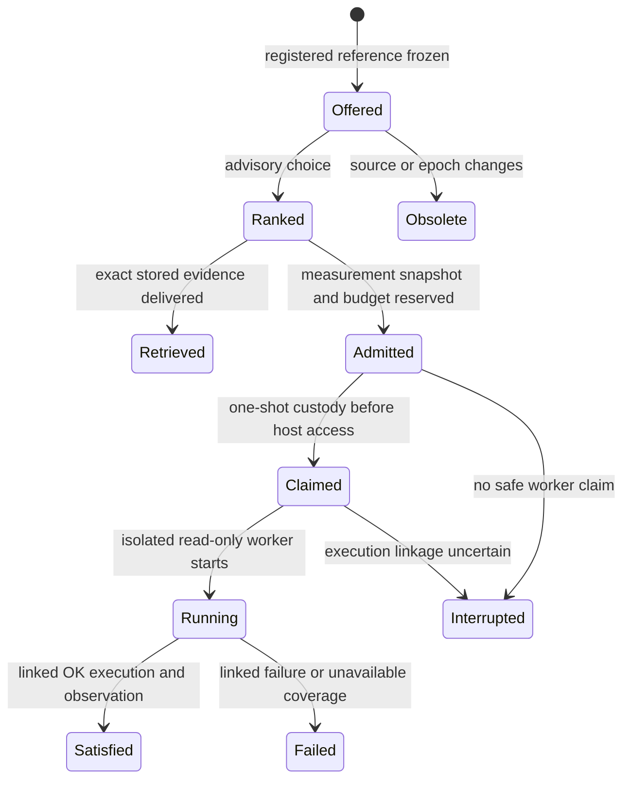

# Persistent mixed frontier: execution boundary

Status: **partially mounted and independently reviewed**. Schema 32 adds a
single-use launch continuation across checkpoint N to N+1; schema 33 persists
mixed investigator turns, selection custody, and reissue lineage. The ordinary
event loop now ranks a fresh, registered `pressure.sample` candidate beside
stored evidence when both are available. Integration tests exercise both
selection orders and one actual linked read-only host execution. This is a
narrow active slice, not a general diagnostic-performance result.

## Decision and trade-offs

The selected path is one atomic transaction for admission, worker claim,
checkpoint advance, and `measurement_admitted` outcome, followed by a
single-use, deadline-fenced worker launch. A simpler post-checkpoint admission
would invalidate the candidate epoch; loosening the epoch check would grant a
stale decision new host authority. The trade-off is additional durable state
and short launch deadlines. A missed launch remains an uncertain attempt and
is never replayed. Revisit this design if a proven scheduler can carry the
same custody across checkpoints with fewer states.

The mounted general measurement is synchronous within one event turn. The
existing bounded parallel baseline/follow-up scheduler is separate; this
slice does not establish broad parallel mixed scheduling. Fast and deep
models remain replaceable advisers. No cloud inference or repair is added.

## Why this is a separate state machine

Retrieving a stored row and sampling Windows are different actions. The first
can be satisfied when that exact row enters a focused checkpoint. The second
requires a registered invocation, budget reservation, one-shot worker claim,
read-only host execution, and source-bound result reconciliation. Neither
Laya's selection nor an admission is an observation.

There is also an epoch race. `CaseCandidateRegistry` binds a candidate to the
case's exact checkpoint version. The ordinary investigator saves an attention
checkpoint each loop. If it saves the selected measurement first and attempts
worker admission afterward, the candidate is stale; weakening the registry to
ignore that version would admit decisions against changed state. A durable
mixed route must make the selection-to-dispatch handoff explicit.

The checkpoint that records `measurement_admitted` commits the exact ranking
snapshot, selected frontier item, admission, worker-claim custody, and turn
outcome together. The implementation claims a one-shot dispatch in that short
transaction *before* advancing the checkpoint, then launches the read-only
worker afterward through a versioned, single-use continuation. The continuation
binds the old selection and admission epoch, exact resulting checkpoint,
owner, task, invocation, and claim. Its verifier accepts only that authorized
checkpoint transition, not arbitrary later state changes.

Claiming does not assert that execution happened. A crash between claim and
launch is an explicit uncertain attempt that is not replayed. The runner must
still recheck the manifest, source, target identity, permission class,
resources, and deadline immediately before host access. It records the
immutable selection/execution epoch separately from the current launch-fence
checkpoint: execution linkage currently requires the execution state version
to equal the admission epoch. Recording only the new checkpoint version would
make an otherwise successful execution unlinkable. A claim does not license
operation after an unrelated newer checkpoint or a changed binding. Exact
execution and evidence links close the item separately.

Provider inference and probe execution are never inside that transaction.
The attention deadline bounds ranking; the probe has its own registered
timeout. The event session's eight-turn budget and case's 32-turn budget remain
separate from probe and host-resource budgets. A blocked, expired, cancelled,
or unavailable action becomes a typed gap; it is not silently retried.

## Candidate discovery and continuation

The coordinator, not a model, derives candidate invocations from fresh case
evidence, typed probe registrations, observed entities, applicable questions,
and the dependency graph. The graph proposes *where to look*; it does not
establish a cause or authorize a probe. Each reference binds the exact probe,
target, parameters, window, source/dependency IDs and digests, manifest,
cost, resource class, and epoch. The model sees a safe reference and description,
never raw selectors or execution authority. Missing capabilities and denied
or stale sources are explicit observability gaps.

Stored retrieval IDs can be refreshed after an evidence-generation advance
using schema-31 predecessor-to-successor lineage. Measurement IDs are
different: any checkpoint advance requires rebuilding the trusted catalog and
reissuing eligible candidates under the new epoch. A successor is a new ID,
not a mutation of the old ID. Persist its predecessor mapping and verified
binding equivalence; a changed process creation time, window, manifest,
source, or dependency is a gap or a genuinely new choice. Historical selection
and uncertain attempts are never made eligible again by reissue.

When available, a mixed turn can offer both an eligible retrieval and a
registered measurement for a non-PDF case. Later turns preserve unselected
alternatives without carrying stale candidate authority. Historical v1/v2
retrieval tails retain FIFO order; v3 reranks current references and records
offered order, deferral counts, and reissue lineage. A stale pending candidate
with no eligible successor closes as an explicit gap. These bounds prevent
silent skipping or replay; they do not prove Laya chooses useful work.

A semantic packet used to select a measurement must come from a frozen
`FrontierPacketReceiptRepository` receipt. Passing caller-constructed packet
text to snapshot capture is invalid. At reservation and before admission,
revalidate the event source, objective/graph/evidence versions, focused
packet, receipt bytes, registry, target, budget, and deadline. Do not broadly
permit evidence-generation drift in a request that also contains retrieval
IDs. A deep-brain redirection is advisory and enters the same candidate
validation path; it cannot bypass it.

## Acceptance gates

1. Upgrade a populated schema-31 store without changing historical v1/v2
   readback. Reject forged candidate, receipt, lineage, or admission links.
2. In an ordinary non-PDF case, offer a stored fact and a registered read-only
   measurement together; controlled ranking selects each in separate tests.
   The measurement test proves one admission, at most one claim/execution, a
   linked result event, and honest failed coverage.
3. Resume after reservation, admission, claim, execution persistence, and
   case stop. No crash point may replay an uncertain action or mark an
   unobserved item satisfied. Prove one successful old-epoch execution link
   through the authorized checkpoint fence, and reject stale owners, duplicate
   launches, stopped cases, and failed launches.
4. Exercise retrieval then measurement then event-driven reranking, with
   checkpoint-only and evidence-generation advances, source deletion, target
   replacement, manifest changes, capacity pressure, cancellation, and a slow
   deep provider. Retained alternatives must remain bounded and fair.
5. Run full test, type, lint, format, build, and read-only live checks. A
   synthetic passing fixture proves these contracts only; diagnostic utility
   requires a controlled affected-task oracle and held-out paired episodes.

This design deliberately does not add arbitrary commands, paths, URLs, or a
repair route. Repairs remain behind a separately consented executor and
independent task verification.
